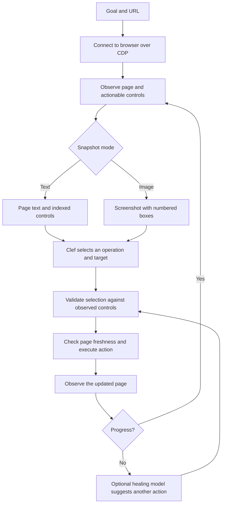

# S1 Visual Browser Agent

S1 Visual Browser Agent is an experimental TypeScript browser-agent project for goal-driven UI automation. It observes a page, asks the Clef model to choose one of the actions it has actually observed, validates that choice locally, and executes it through Chrome DevTools Protocol (CDP).

## Inspiration

The text-based interaction mode is adapted from the `jev-ultrafast` repository, which inspired this project. S1 Visual Browser Agent builds on that foundation with an image-based mode that gives the Clef model a screenshot annotated with numbered controls, while keeping the same locally validated action path.

## Why the numbered screenshot is different

Most screenshot-driven agents ask a model to point at pixels. S1 Visual Browser Agent instead draws numbered boxes over the controls found by its page reader, then asks the Clef model to choose one of those numbers. The number on the image is the same index used by the text snapshot and by the local action map.

That shared index is the key: the model gets the visual context of the page, while the code retains a grounded mapping from its answer to an observed, actionable control. The model does not return coordinates, CSS selectors, or browser code. This brings visual understanding into the decision step without giving up the constrained execution path.

S1 Visual Browser Agent reads and indexes the page first, draws the boxes from that snapshot, captures the frame, and removes the overlay. If navigation invalidates the document during capture, it retries the observation so that the image and action map continue to describe the same page. The screenshot is captured as JPEG at quality 72.

### Snapshot modes

Choose a mode per run with `vision`:

| Mode | Model input | Model selection |
| --- | --- | --- |
| Text | Page URL, title, visible text, and indexed controls | An observed element index |
| Image | Page URL, title, recent actions, and a screenshot with numbered boxes | The number shown on the target |

Both modes use the same operation and target questions, local validation, freshness checks, and execution path. Image mode changes how the model reads the page; it does not change how an action is authorized or executed.

## Architecture



### Main components

- **Browser reader (`src/browser/`)** connects to Chrome over CDP, reads the visible page, builds the action list, captures screenshots, and executes browser actions. A target is offered only when it is visible, enabled, and reachable at its center. The reader accounts for clipping, covering elements, open shadow roots, and overlays.
- **Policy (`src/policy/`)** groups observed actions into operation and target choices, builds the provider request, validates the returned choice against the offered IDs, and maps it to the local action. A single available target is selected deterministically without asking the model to choose between one option.
- **Harness (`src/harness/`)** holds the state of a run and drives each step. LangGraph routes a command through `decide`, `execute`, and, when required, `recover`. State such as page observations, decisions, action history, and model calls is kept by the session between commands.
- **Healing (`src/heal/`)** can ask a separate, optional model for a new observed action when the run repeats itself or the decision model reports that it is blocked. The proposed move goes through the same local action mapping and validation path. Healing is bounded; it does not replace the normal decision model for a run that is making progress.
- **Text helper (`src/text/`)** supplies text for `TYPE_TEXT` through a separate OpenAI-compatible model endpoint.
- **Inspector and client (`src/inspector/`, `web/`)** provide a loopback-only HTTP inspector and a React interface for starting runs, choosing text or image mode, viewing the browser, pausing the run, and exporting its trace.

## Quick start

Requirements: Bun 1.2 or newer and Chrome with remote debugging enabled.

```bash
bun install
cp .env.example .env
```

Set the model credentials and endpoints in `.env`, then start the inspector:

```bash
bun run src/inspector/main.ts
```

Open [http://127.0.0.1:8766](http://127.0.0.1:8766). The inspector binds to loopback and reads `.env` from the directory where it is started. The decision model is required. The text model is used for `TYPE_TEXT`; the heal model is optional.

To connect Chrome, open `chrome://inspect/#remote-debugging` and enable **Allow remote debugging** for the browser instance. Set `BU_CDP_URL` or `BU_CDP_WS` in `.env` if you already have a CDP endpoint.

## Use the TypeScript API

```ts
import { open } from "./src/index.ts";

await using agent = await open(
  "https://www.google.com/travel/flights?hl=en",
  "Find one-way flights from Zurich to London on September 20, 2026, for one adult in economy. Stop when matching flight options are visible.",
  { vision: true },
);

for await (const state of agent.run()) {
  console.log(state.elapsed_ms, state.status);
}
```

`open(url, goal, config)` returns a session with `command()`, `snapshot()`, `run()`, and `close()`. `vision: true` enables the numbered screenshot mode. See `src/harness/config.ts` for the full configuration surface.

## Run checks

```bash
bun run check
bun test
bun run build
```

Tests are offline and do not call paid model APIs. `bun run build` writes the package bundle to the ignored `dist/` directory.

## Project layout

| Path | Responsibility |
| --- | --- |
| `src/index.ts` | Public API |
| `src/harness/` | Session state, LangGraph orchestration, execution, and recovery |
| `src/browser/` | CDP connection, page observation, action execution, screenshots, and numbered overlays |
| `src/policy/` | Operation and target choices, prompts, and answer validation |
| `src/heal/` | Optional stuck-run recovery model |
| `src/text/` | Text-entry helper |
| `src/inspector/` | Local HTTP API and asset serving |
| `web/` | React inspector client |
| `tests/` | Offline tests |

## Current boundaries

- Each run controls one browser tab. Links and forms that would open a second tab are directed back to the run's tab.
- Every model-selected target must map to a control from the current observation. Browser mutations are not retried automatically.
- A screenshot model must support image input and the structured decision request used by the configured provider.
- Healing requires its own configured endpoint and credential. Without them, the run uses its regular blocked or step-limit behavior.
- The project is experimental. Evaluate it against your own sites and task set before relying on it for unattended workflows.
